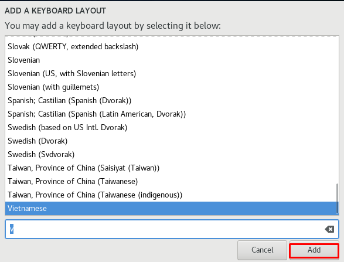

## Cài đặt CentOS7 trên VMware
### Chuẩn bị

Phần mềm Vmware, file iso phiên bản CentOS7.
### Các bước cài đặt 

Cách cài đặt máy ảo có thể tham khảo https://github.com/chinguyen97/BaoCaoThucTapMDT/blob/master/Ghi_chep_Linux/Install_UbuntuServer.md

#### Tiến hành cài đặt CentOS7

- Chọn Settings. Chọn file iso CentOS7

- Chọn ngôn ngữ trong quá trình cài đặt

- Đây là màn hình mặc định cho một số cài đặt cơ bản. 

- Cài đặt múi giờ, nhấn biểu tượng **DATE&TIME**

- Nhấn chọn 1 điểm trên bản đồ bạn muốn đặt múi giờ và nhấn nút **Done**

- Tiếp theo nhấn biểu tượng **KEYBOARD**.

Nhấn nút **+** phía dưới bên trái nếu muốn thêm loại bàn phím khác cho ngôn ngữ của bạn.

Chọn kiểu bàn phím rồi nhấn **Add**

Nhấn **Done**

- Đối với **SOFTWARE SELECTION**, bạn có thể giữ mặc định vì nó đã cài đặt tốt hơn với **Minimal Install** để cài đặt ban đầu. 

- Tiếp theo, nhấp vào biểu tượng **INSTALLATION DESTINATION**.

Chọn đĩa cài đặt. Nhấp vào biểu tượng đĩa bạn muốn cài đặt và nhấp vào nút “Done” ở phía trên bên trái để tiếp tục. Nếu bạn muốn tùy chỉnh bố cục phân vùng, hãy đánh dấu hộp **I will configure partitioning** và tiếp tục.

- Trở lại màn hình mặc định. hãy nhấp vào biểu tượng **NETWORK & HOSTNAME**.

- Nhập bất kỳ tên máy chủ nào bạn thích trong trường **Hostname** và nhấp vào nút **ON** ở phía trên bên phải để cho phép kết nối mạng.

Nhấp vào nút **Done** ở phía trên bên trái để kết thúc.

- Nhấn **Begin Installation** và tiếp tục.

- Quá trình cài đặt bắt đầu, yêu cầu thiết lập mật khẩu Root và tạo ra một người dùng thông thường. Nhấp vào mỗi biểu tượng và di chuyển đến cấu hình.

- Trên cài đặt mật khẩu Root, nhập mật khẩu bạn muốn và nhấp vào nút **Done** để kết thúc.

- Tạo người dùng, nhập bất kỳ tên người dùng và mật khẩu mà bạn muốn và nhấp vào nút **Done** để kết thúc.

- Sau khi hoàn tất cài đặt, nhấn vào nút **Reboot**

Quá trình cài đặt thành công
