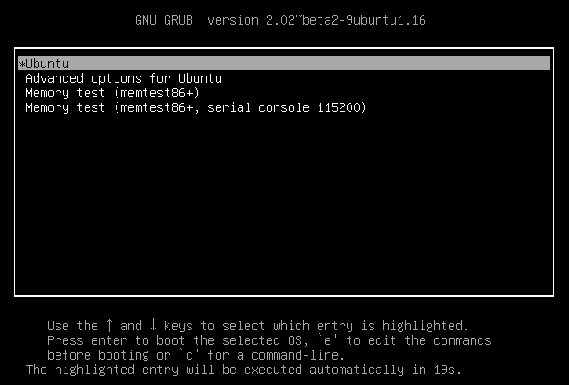
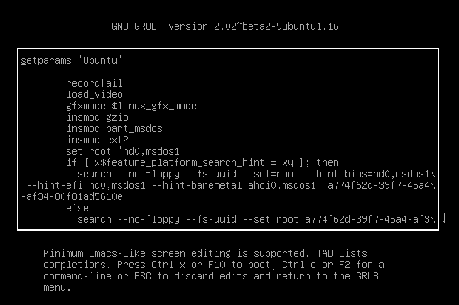
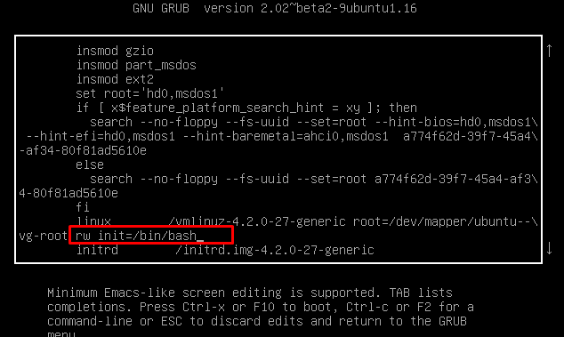
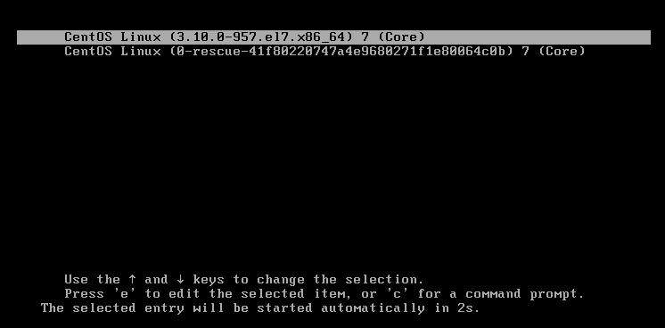
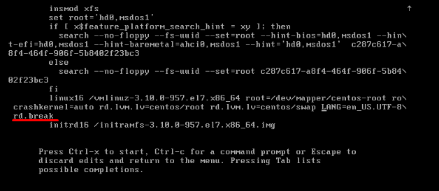

## Reset Root Password

***Bài viết đề cập nội dung khôi phục mật khẩu root cho ubuntu14 và CentOS7***

### 1. Reset root password Ubuntu Server 14

Để khôi phục lại mật khẩu root bạn cần thực hiện các bước sau.

**Bước 1**: Khởi động lại hệ thống vào **GRUB2** boot loader menu.

- Bấm ESC để màn hình dừng lại. Ở dòng entry *UBuntu* ấn **e** để thực hiện chỉnh sửa boot loader.



**Bước 2**: Chỉnh sửa thông số entry GRUB2
- Cấu hình GRUB2 sẽ có các thông số như hình.



Di chuyển xuống dòng cấu hình băt sdadauf bằng "linux..." thay **ro** = **rw** và thêm init=/bin/bash vào cuối dòng cấu hình



**Lưu ý**: Nếu có nôi dung cấu hình **quiet splash** và **$vt_handoff** nếu có trước khi reset root password 

- Ấn **Ctrl+X** hoặc **F10** để lưu và tự động boot vào môt trường initramfs.

**Bước 3**: Remount filesystem

- Kiểm tả xem filesystem đã được mount quyền đọc-ghi (rw) hay chưa. Để thực hiện khôi phục mật khẩu root thì cần thêm quyền ghi trong filesystem

```
mount | grep -w /
```
Nếu kiểm tra vẫn chưa thấy ở chế độ rw, thì sẽ tiến hành remount lại filesystem root / với quyền đọc ghi. 

```
mount -o remount, rw /
```
**Bước 4**: Đổi mật khẩu và reboot

- Đổi mật khẩu:

```
passwd root
```
- Khởi động lại hệ thống

```
exec /sbin/init
```

### 2. Reset root password CentOS7

Chỉ có thể áp dụng nếu GRUB2 boot loader không setup mật khẩu mã hóa. 

**Bước 1**: Khởi động lại hệ thống

- Khởi động lại hệ thống, bấm nút ESC để màn hình dừng lại, sau đó ấn nút **e** để thực hiện chỉnh sửa.



**Bước 2**: Chỉnh sửa thông số entry 
- Đến dòng entry cấu hình **linux16**. Xóa thông số **rhgb quiet** để kích hoạy log message hệ thống khi thực hiện đổi mật khẩu root. Thêm vào cuối dòng thông số **rd.break**



Ấn **Ctrl+x** để lưu và tự động boot vào môi trường initramfs.

**Bước 3**: Remount filesyste

- Hệ thống filesystem hiện đang ở chế độ read được mount ở thư mục /sysroot/, để thực hiện khôi phục mật khẩu thì cần có thêm quyền ghi. Tiến hành remount lại filesystem /sysroot/ với quyền r-w

```
mount -o remount, rw /sysroot
```
- Kiểm tra lại
```
mount | grep -w "/sysroot"
```
- Chuyển sang môi trường filesystem (prompt:sh-4.2#)
```
chroot /sysroot
```
- Reset root password
```
sh-4.2# passwd root
```


**Bước 4**: Relabel SELINUX

```
sh -4.2# touch /.autorelabel
```
Chạy lệnh này để update các thông số cấu hình SELINUX. Nguyên nhân khi update file /etc/passwd thì các thông số SELINUX security contex sẽ khác nên cần được update.

**Bước 5**: Remount và reboot

- Remount filesystem "/" ở chế độ read-only
```
sh-4.2# mount -o remonut,ro /
```
- Thoát môi trường chroot và khởi động lại hệ thống
```
sh -4.2#exit
switch_root:/# exec /sbin/reboot
```
Sau khi reboot vào hệ thống thành công thì bạn có thể đăng nhập bằng mật khẩu mới. 


### Tài liệu tham khảo: https://cuongquach.com/reset-root-password-tren-ubutnu-14-16.html
