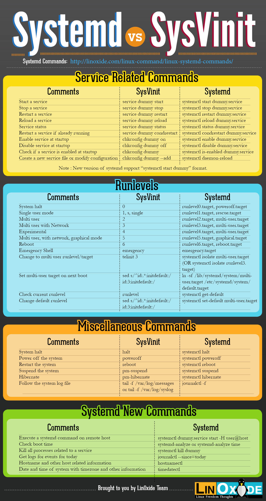

### SERVICE_LINUX

### 1. SERVICE 
Service _ Dịch vụ là các ứng dụng hoặc bộ các ứng dụng chạy trên hệ thống

Hệ điều hành LInux lưu trữ các tệp dịch vụ tại `/etc/services`. Nó lưu trữ thông tin vầ nhiều dịch vụ mà các ứng dụng khác có thể sử dụng trên máy tính. Trong tệp bao gồm: Tên dịch vụ, số cổng dịch vụ, giao thức mà nó sử dụng.

Bạn có thể cấu hình lại số cổng bằng cách chỉnh sửa file `/etc/services` bằng các trình soạn thảo.

### 2. Init file

Init process là một tiến trình được khởi động lên đầu tiên trong hệ thống Linux. Tức là sau khi bạn chọn hệ điều hành trong menu của Boot Loader. Hệ điều hành bắt đầu được khởi động và tiến trình đầu tiên khởi động lên là init. Nhiệm vụ của init là start và stop các process, services… cần thiết khác.

Vì init là tiến trình được khởi động đầu tiên của hệ thống Linux nên:
- Init process luôn có PID (Process ID) là 1.
- Tiến trình init là tiến trình cha của các tiến trình khác.

Có ba kiểu triển khai init system chính trong hệ thống Linux là:

### 2.1 System V  
Là phiên bản truyền thống của init system trên nhiều hệ thống Linux phát hành năm 1983

1 số distro  sử dụng System V
- Debian 6 trở về trước
- ubuntu  9.04 trở về trước
- CentOS 5 trở về trước

Trong SysV init, có 1 số phương thức hoạt động được gọi là runlevel. Ví dụ: Level 3: bắt đầu giao diện dòng lệnh với nhiều người dùng. Level 5: Bắt đầu gao diện đồ họa, 0: tắt máy, 6 khởi động lại. 

### 2.2. Upstart

Được phát triển bởi Canonical vào khoảng năm 2009 và sử dụng trong các phiên bản Ubuntu cũ hơn bản 15.04.

Một số distro hỗ trợ Upstart (đa phần là Ubuntu vì Upstart vốn được phát triển cho riêng Ubuntu)

Từ Ubuntu 9.10 tới Ubuntu 14.04, 14.10
CentOS 6

### 2.3. Systemd

Systemd: Là một init system được phát triển khoảng năm 2010 và được nhiều Linux distributions sử dụng để thay thế các init system cũ. Ubuntu từ phiên bản 15.04 và Centos từ phiên bản 7 đã sử dụng systemd làm init system mặc định.

Systemd không chỉ dừng lại ở việc start hoặc stop các services nó còn có thể mount filesystems, quản lý network sockets… Và để thực hiện được những công việc đó nó phân chia ra các đơn vị units:

Để kiểm tra xem hệ thống của bạn có đang sử dụng systemd hay không thì:

Hãy kiểm tra xem bạn có thư mục /usr/lib/systemd không.

Hoặc Gõ lệnh `pstree -Ap | more` bạn sẽ nhìn thấy systemd có process ID là 1 và nó là cha (hoặc ông nội :)) ) của các process khác.(ubuntu)

Systemctl để giám sát và điều khiển systemd. 

- Hiển thị trạng thái 1 hệ thống `systemctl status`

Runlevel

|Level|Generic|Fedora / Core| Slackware|Debian|
|---|---|---|---|---|
|0|Halt|Halt|Halt|Halt|
|1|Single-user mode|Single-user mode|Single-user mode|Single-user mode|
|2|Basic multi-user mode (without networking)|User definable (Unused)
|User definable - configured the same as runlevel 3|Multi-user mode|
|3|Full (text based) multi-user mode|Multi-user mode|Multi-user mode - default Slackware runlevel|...|
|4|Not used|Not used|X11 with KDM/GDM/XDM (session managers)|Multi-user mode|
|5|Full (GUI based) multi-user mode|Full multi-user mode (with an X-based login screen) - default runlevel|User definable - configured the same as runlevel 3| Multi-user mode|
|6|Reboot|Reboot|Reboot|Reboot|

So sánh SystemVinit và Systemd 

### 3. Unit file

Unit file là các tin cấu hình xác định các nguồn tài nguyên.
- Liệt kê các unit đã được load `systemctl list-units`

Các unit của Systemd dựa trên loại tài nguyên mà chúng mô tả. 
+ Service units (.service) – để start và stop các service.
+ Mount units (.mount) – Để quản lý các mount point.
+ Target units (.target) – Để điều khiển các “runlevels” (khái niệm runlevels chỉ sử dụng trong SysV init).

