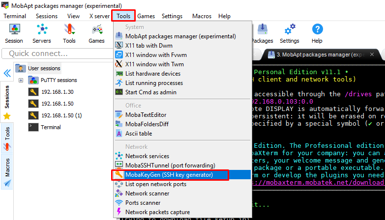
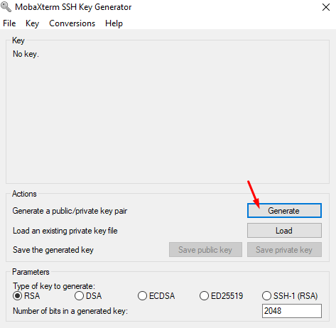
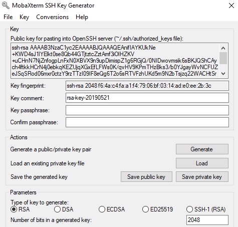
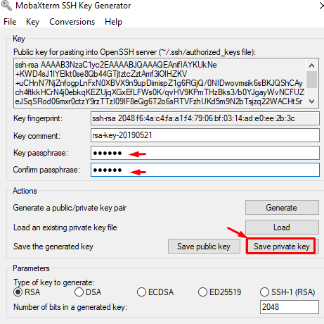
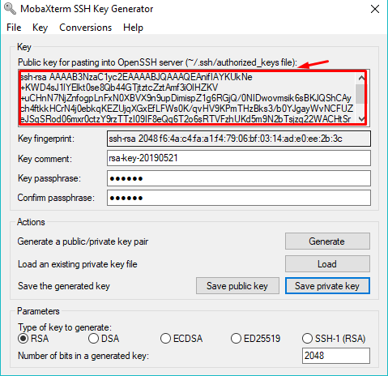
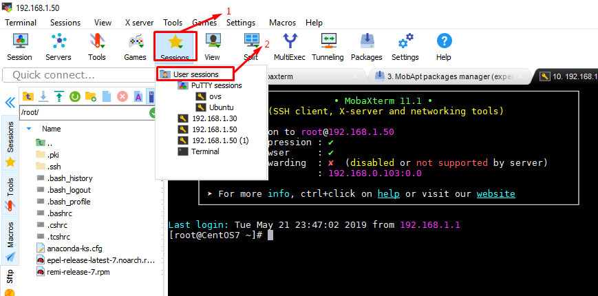
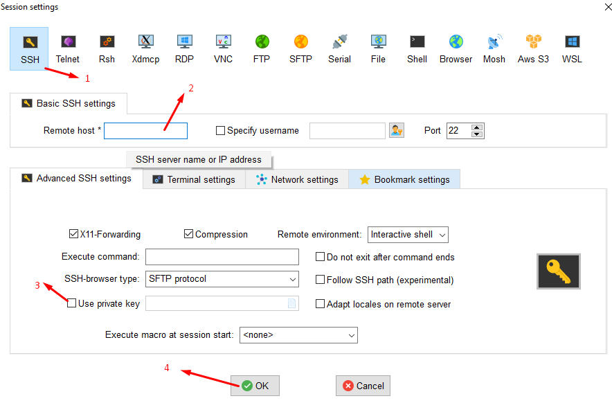

### SSH Keypair

Cách thức hoạt động

SSH key là một phương thức chứng thực người dùng truy cập bằng cách đối chiếu giữa một key cá nhân (Private Key) và key công khai(Public Key).
Private key và Public key luôn có liên hệ chặt chẽ với nhau để nó có thể nhận diện lẫn nhau. Public key đặt tại máy chủ, private key đặt máy khách. KHi đăng nhập vào máy chủ, nhập kèm theo cái Private Key này để gửi tín hiệu đến server, server sẽ kiểm tra xem cái Private key của bạn có khớp với Public key có trên server hay không, nếu có thì bạn sẽ đăng nhập được.

Nội dung giữa Private Key và Public Key hoàn toàn khác nhau, nhưng nó vẫn sẽ nhận diện được với nhau thông qua một thuật toán riêng của nó.

Private Key là chìa khóa, còn Public Key là ổ khóa. 

Thành phần chính của 1 SSH Key.

- Gồm 3 thành phần: 
	+ **Public Key** (dạng file và string) – Bạn sẽ copy ký tự key này sẽ bỏ vào file **~/.ssh/authorized_keys** trên server của bạn.
	+ **Private Key** (dạng file và string) – Bạn sẽ lưu file này vào máy tính, sau đó sẽ thiết lập cho PuTTY, WinSCP, MobaXterm,..để có thể login.
	+ **Keypharse** (dạng string, cần ghi nhớ) – Mật khẩu để mở private key, khi đăng nhập vào server nó sẽ hỏi cái này.


- Cách tạo ra SSH Key

### 1. Với Windows

Có thể sử dụng phần mềm MobaXterm

Thiết lập các tùy chọn như hình: 





Sau khi tạo xong nso xuất hiện như hình:



Đặt keypharse . Sau đó ấn **Save Private Key** và lưu nó trên một nơi thật an toàn (Nhớ vị trí lưu file).



Copy đoạn public key ( đoạn abwts đầu nbanwgf từ **ssh-rsa-XXXXXX**) bỏ vào server.  bạn chỉ cần ấn nút Load trong phần mềm PuTTYGen rồi mở file private key lên là nó tự hiện ra public key.



### 2. Đối với LINUX

Gõ tại Terminal 

`ssh-keygen -t rsa`

Nó sẽ hỏi bạn muốn lưu private key này vào đâu, mặc định nó sẽ lưu vào **/home/user/.ssh**. Bạn có thể để trống và **Enter**.

Tiếp tục nó sẽ hỏi bạn có muốn thiết lập keypharse không, nếu muốn thì nhập keypharse cần thiết lập vào rồi Enter.

Sau khi tạo xong, mặc định nó sẽ hiện ra 1 đoạn text. Trong đó bạn có thể thấy nó có ghi đường dẫn lưu file private key (id_rsa) và file public key (id_rsa.pub). Để xem được public key, bạn cứ mở file đó lên mà đọc nhé.

Và cái public key này bạn sẽ mang lên VPS.

### 3. Thêm public key vào VPS

Bây giờ hãy đăng nhập vào VPS với user mà bạn cần thêm key (thường thì là root, nhưng nếu VPS bạn có nhiều user thì sẽ cần thêm key cho tất cả user đó).

Sau đó gõ các lệnh dưới đây để tạo thư mục .ssh/ và file authorized_keys trong thư mục đó:

```
mkdir ~/.ssh
chmod 700 ~/.ssh
touch ~/.ssh/authorized_keys
chmod 600 ~/.ssh/authorized_keys
```
Sau đó mở file authorized_keys trong thư mục **.ssh** ở thư mục gốc của user và copy toàn bộ ký tự của public key vào.

**NOte:** SSH Key sẽ không thể hoạt động nếu bạn đang bật SELinux. Hãy tắt SELinux đi bằng cách mở file **/etc/selinux/config**, tìm **SELINUX=enforcing** và thay bằng **SELINUX=disabled**. Sau đó gõ lệnh reboot để khởi động lại server. Nếu dùng Centminmod thì không cần vì nó đã tắt SELinux rồi.


Để kiểm tra xem nó đã hoạt động chưa, hãy đăng nhập lại vào SSH với tài khoản vừa thêm SSH Key. Nếu bạn đăng nhập bằng Linux thì nó sẽ tự hỏi keypharse của bạn, còn nếu bạn đăng nhập ở Windows thông qua các phần mềm khác như **MobaXterm** thì khi đăng nhập, bạn phải trỏ file private key vào để nó chứng thực.





Bây giờ bạn đăng nhập và nó sẽ hỏi keypharse nếu bạn có đặt keypharse, còn không đặt là nó dẫn bạn vô thẳng server.

Tắt chức năng sử dụng mật khẩu
Sau khi kiểm tra, nếu bạn thấy đã có thể đăng nhập vào server bằng SSH Key thì có thể tắt chức năng sử dụng mật khẩu đi vì nếu không tắt, các attacker vẫn brute force attack như thường và bạn vẫn bị mất dữ liệu nếu lộ mật khẩu.

Để tắt chức năng sử dụng mật khẩu, bạn mở file **/etc/ssh/sshd_config**, và tìm rồi sửa các giá trị của các tham số như ở dưới:
```
PasswordAuthentication no
UsePAM no
```


***Tài liệu tham khảo***: 
https://thachpham.com/linux-webserver/huong-dan-ssh-key.html